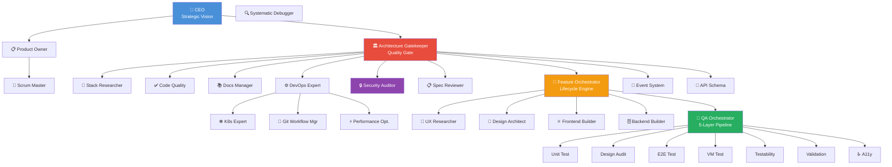

# 🤖 Paperclip Fullstack Agent Swarm

> **30 specialized AI agents** for end-to-end software development — from idea to deploy.

[]() []() []() []()

---

## ⚡ What Is This?

A multi-agent system where **30 AI agents** collaborate to plan, design, build, test, secure, and deploy software. Each agent has its own persona, expertise, and workflow — defined by 4 configuration files.

**Not a generic chatbot. Every agent is a specialist.**

```
User provides feature goal → 30 agents deliver production-ready software
```

### Key Differentiators

| | What | Why It Matters |
|-|------|---------------|
| 🎯 | [obra/superpowers](https://github.com/obra/superpowers) | TDD Iron Law, 4-Phase Debugging, Verification Evidence |
| 🎨 | [pbakaus/impeccable](https://github.com/pbakaus/impeccable) | OKLCH colors, 4pt grid, AI Slop Test (16 anti-patterns) |
| 🛡️ | Anti-Hallucination Protocol | Every agent self-checks + peer-verifies before delivery |
| 🔌 | [skills.sh](https://skills.sh) | 60+ skills from 17 open-source repositories |

---

## 🏗️ Architecture



---

## 🔄 Feature Lifecycle

```mermaid
graph LR
    subgraph Planning
        B["1. Backlog"] --> G["2. Goal"] --> SP["3. Spec Review 🆕"] --> PRD["4. PRD"]
    end

    subgraph Design
        PRD --> API["5. API Spec"] --> R["6. Research"] --> UX["7. UX Spec"] --> DS["8. Design Spec"] --> V["9. Validation"]
    end

    subgraph Build
        V --> BR["10. Branch 🆕"] --> CODE["11. Code"] --> SEC["12. Security 🆕"] --> PERF["13. Performance 🆕"] --> A11Y["14. A11y 🆕"]
    end

    subgraph Delivery
        A11Y --> QA["15. QA"] --> QG["16. Quality Gate"] --> DOC["17. Docs"] --> MG["18. Merge 🆕"] --> DEP["19. Deploy"] --> SC["20. Scorecard"]
    end

    style Planning fill:#E8F4FD,stroke:#4A90D9
    style Design fill:#FEF9E7,stroke:#F39C12
    style Build fill:#FDEDEC,stroke:#E74C3C
    style Delivery fill:#E8F8F5,stroke:#27AE60
```



---

## 👥 All 30 Agents

### 🔵 Leadership & Strategy (4)
| Agent | Superpower |
|-------|-----------|
| CEO | Strategic HARD-GATE, P0-P3 Decision Framework |
| Product Owner | Brainstorming, Bite-Sized Writing Plans |
| Scrum Master | Subagent-Driven Development, Sprint Cadence |
| Architecture Gatekeeper | HARD-GATE, Design-for-Isolation, YAGNI |

### 🟢 Design & Research (3)
| Agent | Superpower |
|-------|-----------|
| UX Researcher | Nielsen's 10 Heuristics, Optimistic UI |
| Design Architect | OKLCH, 4pt Grid, AI Slop Test |
| Stack Researcher | Context7, Firecrawl, `skills search` |

### 🟡 Build (3)
| Agent | Superpower |
|-------|-----------|
| Feature Orchestrator | 21-Step Lifecycle, Subagent Dispatch |
| Frontend Builder | TDD Iron Law, React 19, Impeccable Design |
| Backend Builder | Contract-First TDD, Drizzle ORM, RLS |

### 🔴 Quality & Testing (8)
| Agent | Superpower |
|-------|-----------|
| QA Orchestrator | 5-Layer Test Pipeline, Parallel Dispatch |
| Unit Test Writer | RED-GREEN-REFACTOR, Vitest |
| Design Auditor | 16-Point AI Slop Audit, 3 Viewports |
| E2E Tester | Playwright, User Journey Testing |
| VM Tester | Native App Testing, Desktop Automation |
| Testability Expert | 5 Testing Anti-Patterns |
| Validation Expert | Zod Fortress, OWASP Input Validation |
| Code Quality Expert | Pre-Review Checklist, SOLID |

### 🟣 Infrastructure & Architecture (6)
| Agent | Superpower |
|-------|-----------|
| DevOps Expert | CI/CD, Docker, GitHub Actions |
| Kubernetes Expert | Helm, Health Probes, NetworkPolicies |
| Browser Automation | agent-browser, Headless Chrome |
| Docs Manager | Documentation-as-Code, Clear Writing |
| Event-System Expert | Supabase Realtime, Idempotency |
| API Schema Expert | Contract-First TDD, Zod Schemas |

### 🔶 Specialists — NEW (6)
| Agent | Deliverable | Superpower |
|-------|-------------|-----------|
| 🔍 Systematic Debugger | `ROOT_CAUSE.md` | 4-Phase Debugging, Chain-of-Thought |
| 📋 Spec Reviewer | `SPEC_REVIEW.md` | 5-Category Review, Self-Refinement |
| 🌿 Git Workflow Manager | `BRANCH_STATUS.md` | Worktree Lifecycle, Commit Discipline |
| 🔒 Security Auditor | `SECURITY_AUDIT.md` | OWASP Top 10, ReAct Protocol |
| ⚡ Performance Optimizer | `PERFORMANCE_REPORT.md` | Core Web Vitals, Bundle Analysis |
| ♿ Accessibility Expert | `A11Y_AUDIT.md` | WCAG 2.1 POUR (50+ Criteria) |

---

## 🧠 Methodology

### Superpowers ([obra/superpowers](https://github.com/obra/superpowers))

| Principle | Description | Used by |
|-----------|------------|---------|
| 🔴 TDD Iron Law | No code without a failing test first | 8 agents |
| 🔍 4-Phase Debugging | Root Cause → Pattern → Hypothesis → Fix | 15 agents |
| 🚫 HARD-GATE | No code without design approval | 4 agents |
| ✅ Verification Evidence | Proof before claims — always | 20 agents |
| 👥 Subagent-Driven Dev | Fresh subagent per task, two-stage review | 5 agents |
| 🌿 Git Worktrees | Branch isolation via worktrees | 4 agents |

### Impeccable Design ([pbakaus/impeccable](https://github.com/pbakaus/impeccable))
- **OKLCH** Color System with tinted neutrals (no pure black/white)
- **4pt Grid** Spacing (not 8pt — more granular control)
- **Exponential Easing** only (no bounce, no generic `ease`)
- **AI Slop Test** — 16-point audit to avoid generic AI aesthetics

### Advanced Reasoning
| Technique | When | Agent Example |
|-----------|------|--------------|
| Chain-of-Thought | Complex decisions | Debugger: 8-step CoT |
| ReAct | Exploratory tasks | Security Auditor: Reason → Attack → Analyze |
| Self-Refinement | Before delivery | Spec Reviewer: 4-question loop |
| Few-Shot | Teaching | Accessibility Expert: Bad→Good diffs |

---

## 🔧 Skill Sources

```bash
# Install skills via CLI
skills search "systematic-debugging"
skills install systematic-debugging
```

| Repository | Key Skills | Installs |
|-----------|-----------|----------|
| [obra/superpowers](https://github.com/obra/superpowers) | TDD, Debugging, Plans, Verification, Code Review | 14K–50K |
| [vercel-labs](https://skills.sh) | React Best Practices, Design Guidelines, Browser | 32K–199K |
| [anthropics/skills](https://github.com/anthropics/skills) | Frontend Design, Canvas, Webapp Testing | 17K–145K |
| [pbakaus/impeccable](https://github.com/pbakaus/impeccable) | OKLCH, Grid, Motion, AI Slop Test | — |
| [supabase/agent-skills](https://github.com/supabase/agent-skills) | Postgres Best Practices, RLS | 32K |
| + 12 more repos | 30+ additional skills | 8K–128K |

> Full registry with URLs: [`agents/SHARED_CONFIG.md`](agents/SHARED_CONFIG.md)

---

## 🛡️ Core Principles

| # | Principle | Description |
|---|-----------|-------------|
| 1 | **Goal Check** | Every agent reads GOAL.md first |
| 2 | **Evidence First** | Proof before assertions |
| 3 | **Circuit Breaker** | Max 3 iterations, then escalate |
| 4 | **Error Recovery** | Self → Peer → Gatekeeper (3-tier) |
| 5 | **Anti-Hallucination** | STOP-CHECK-DELIVER before every delivery |
| 6 | **Mandated Stack** | Next.js 15 · React 19 · shadcn · Tailwind 4 |
| 7 | **Contract-First** | API schema before implementation |
| 8 | **Security Gate** | OWASP Top 10 before deploy |
| 9 | **Performance Budget** | LCP < 2.5s, Bundle < 200KB |
| 10 | **WCAG 2.1 AA** | 50+ accessibility criteria |

---

## 🏗️ Tech Stack

| Layer | Technology |
|-------|-----------|
| Framework | Next.js 15 (App Router) |
| UI | React 19 + shadcn/ui |
| Styling | Tailwind CSS 4 |
| State | Zustand + TanStack React Query |
| Validation | Zod |
| ORM | Drizzle ORM |
| Database | Supabase (PostgreSQL) |
| Testing | Vitest + Playwright |
| CI/CD | GitHub Actions + Docker |
| Orchestration | Kubernetes + Helm |
| Agent Runtime | OpenCode (Paperclip) |

---

## 📁 Project Structure

```
agents/
├── AGENTS_OVERVIEW.md     ← All 30 agents with hierarchy
├── SHARED_CONFIG.md       ← Global rules, skill registry, anti-hallucination
├── SKILLS.md              ← Skill reference & discovery
├── REPORTING_PROTOCOL.md  ← Status reporting
│
└── [agent-name]/          ← 30 folders, 4 files each:
    ├── SOUL.md            ← Persona, anti-patterns, reasoning
    ├── AGENTS.md          ← Role, scope, workflow
    ├── TOOLS.md           ← Skills (inline), commands
    └── HEARTBEAT.md       ← Checklists, red flags
```

| Metric | Value |
|--------|-------|
| Agent Folders | 30 |
| Config Files | 124 |
| Skill Sources | 17 Repositories |
| Embedded Skills | 60+ |

---

## 📚 Documentation

| File | Contents |
|------|---------|
| [AGENTS_OVERVIEW.md](agents/AGENTS_OVERVIEW.md) | Agent hierarchy, full list, lifecycle |
| [SHARED_CONFIG.md](agents/SHARED_CONFIG.md) | Global rules, stack, skill registry |
| [SKILLS.md](agents/SKILLS.md) | Skill discovery & top 23 reference |
| [REPORTING_PROTOCOL.md](agents/REPORTING_PROTOCOL.md) | Status reporting templates |

---

## License

MIT

---

<p align="center">
  Built by <a href="https://github.com/servas-ai">servas.ai</a> · Powered by <a href="https://github.com/obra/superpowers">superpowers</a> + <a href="https://github.com/pbakaus/impeccable">impeccable</a> + <a href="https://skills.sh">skills.sh</a>
</p>
